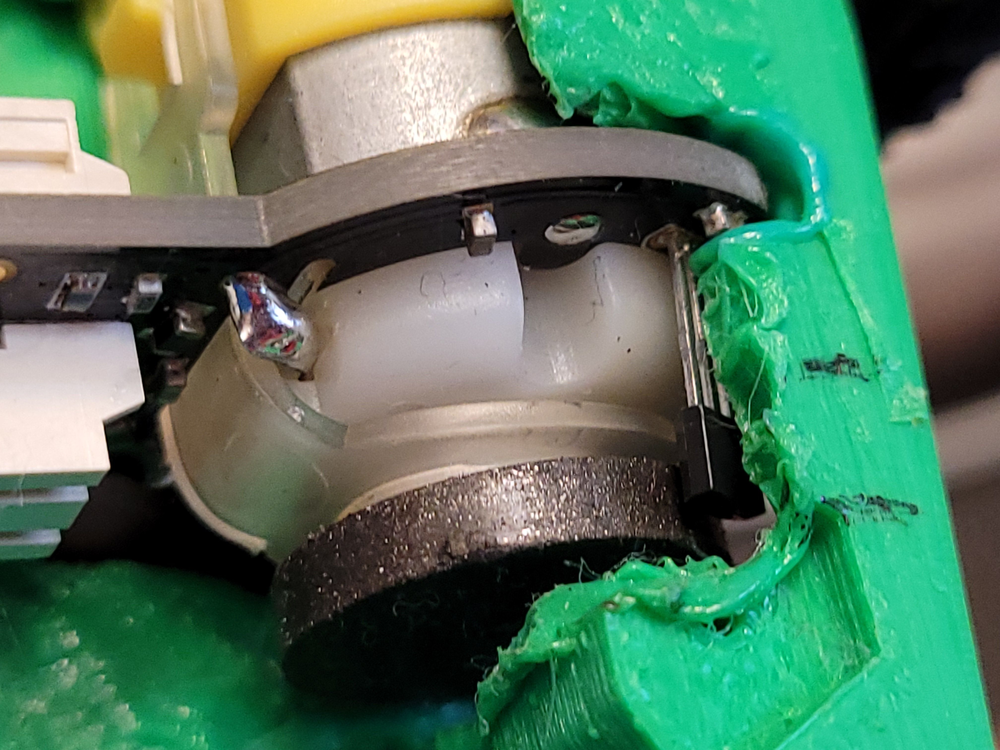

# JetsonNano

- ### Without Proportional Derivate Control (100m travel).
*The vehicle travels for 100 meters.*  
*It does not go straight line due to physical erros,*
*such as friction or dusts on the floor,*  
*or slightly different shape on each wheel.*  
  
  
- ### With PD Control. High spring gain K. (65m travel).  
*The vehicle revocers its track to the center using PD control*  
*With high k value, the vehicle waggles extremely at the beginning, but it finally get back to the center line successfully.*  
*Still not in on the line because there is no Integrate control. Only Proportional + Derivative.*  
  
  
- ### Following blue colored object  
*The vehicle is set to follow only blue colored object.*  
  

---
  
  - ## Arduino  
  *Arduino board was added additionally into the original **Jetbot** configuration*  
  *for the wheel encoder and ultrasonic sensor in the future.*  
  
  
  - ## Wheel Encoder  
  *DC motors with wheel encoder replaced the original motor configuration.*  
  *Wheel encoder for the geometry of the vehicle to approximate its traveled distance.*  
  

